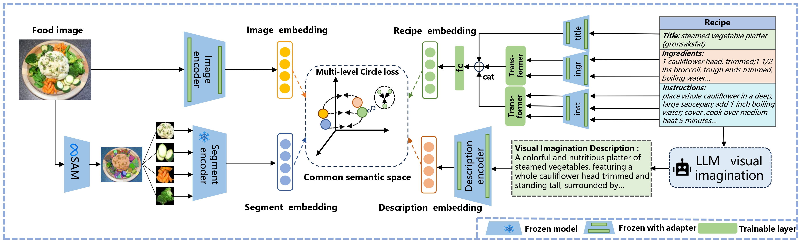

# Enhancing Recipe Retrieval with Foundation Models


Official implementation of our ECCV2024 paper:

**[Enhancing Recipe Retrieval with Foundation Models: A Data Augmentation Perspective ](https://arxiv.org/abs/2312.04763)**

This paper proposes a new perspective on data augmentation using the Foundation Model (i.e., llama2 and SAM) to better learn multimodal representations in the common embedding space for the task of cross-modal recipe retrieval.



---
## The main code has been uploaded first, the data as well as guidance will be updated soon.

## Installation

To install the required packages, please follow these steps:

```bash
# Clone the repository
git clone https://github.com/Noah888/DAR.git

# Create a virtual environment (Python 3.8 or above)
conda create --name your_env_name python=3.9

# Activate the conda environment
conda activate your_env_nam

# Install dependencies
pip install -r requirements.txt
```


## Dataset
To reproduce the results,  Download Recipe1M [dataset](http://wednesday.csail.mit.edu/temporal/release/) and Generate enhanced data ( [traindata](https://drive.google.com/file/d/1mceOq99iyBJ3dG55TQTl983SOscDAK6a/view?usp=drive_link) (with augment visual imagination data)). Place the data in the ```DATASET_PATH``` directory with the following structure:
```bash
DATASET_PATH/
│── traindata/
├── train/
│   ├── ...
├── val/
│   ├── ...
└── test/
│   ├── ...
├── segment/
│    ├── train/...
│    ├── val/...
│    ├── test/...
└── layer1.json
└── layer2.json
```

## Training

- Launch training with:

```
python train.py --model_name model --root DATASET_PATH --save_dir /path/to/saved/model/checkpoints
```

Run ```python train.py --help``` for the full list of available arguments.

## Evaluation

- Extract features from the trained model for the test set samples of Recipe1M:

```
python test.py --model_name model --eval_split test --root DATASET_PATH --save_dir /path/to/saved/model/checkpoints
```

- Compute MedR and recall metrics for the extracted feature set:
   Evaluation with only image and recipe feats(DAR):
```
python eval.py --embeddings_file /path/to/saved/model/checkpoints/model/feats_test.pkl --medr_N 10000
```
   Evaluation with raw image-recipe features as well as augment segments description features (DAR++):
```
python eval_add_augment.py --embeddings_file /path/to/saved/model/checkpoints/model/feats_test.pkl --medr_N 10000
```

## Pretrained models

- We provide pretrained model weights (coming soon):

```
python test.py --model_name MODEL_NAME --eval_split test --root DATASET_PATH --save_dir ../checkpoints
```

- A file with extracted features will be saved under ```../checkpoints/MODEL_NAME```.

This code is based on the [image-to-recipe-transformers](https://github.com/amzn/image-to-recipe-transformers). We would like to express our gratitude.

